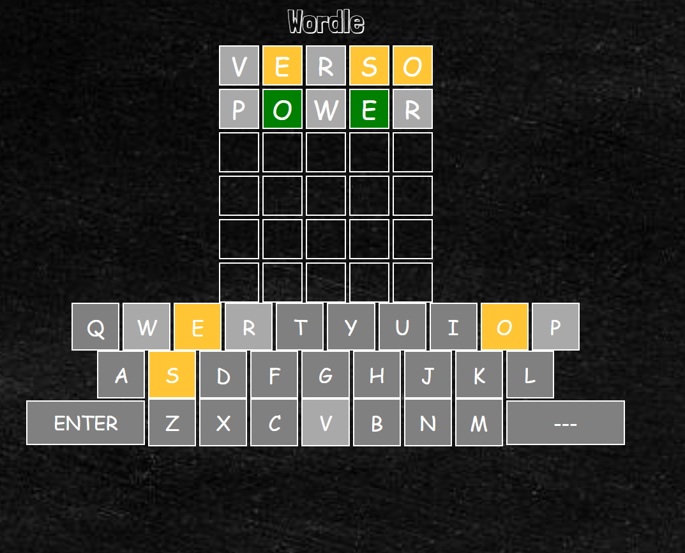
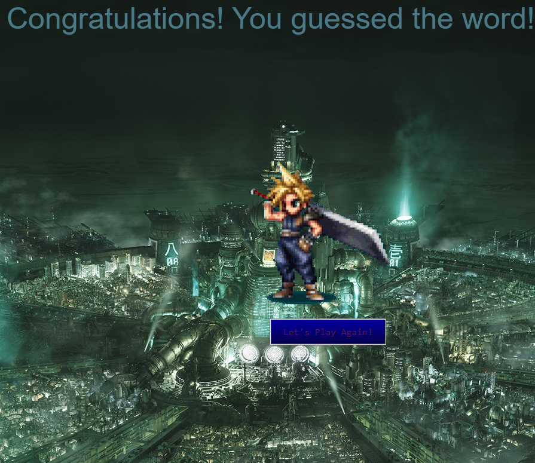
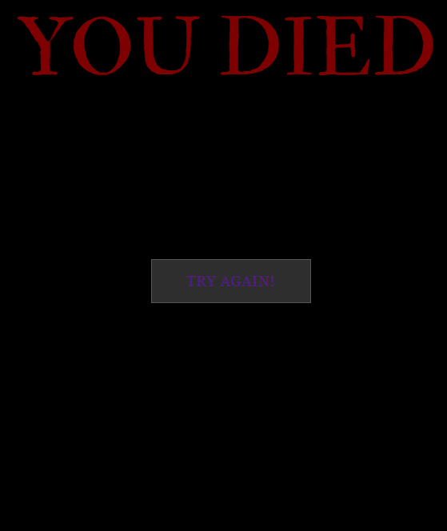

# Wordle

## By: Ali AlDerazi

### Date: February 5th, 2026

#### [GitHub](https://github.com/alialderazi17) | [LinkedIn](https://www.linkedin.com/in/ali-alderazi-b971783a8/)

***
### **Description**
#### The 5-Letter word guessing game Wordle, the winning word is chosen randomly and you have 6 tries to get it right. It is for the Unit 1 Software Engineering Bootcamp Project.
***

### ***Technologies Used***
* HTML
* CSS
* JavaScript
***
### **Getting Started**

#### You are greeted instantly with the board and you start guessing by inputting a word. Each letter will have one of three states, Gray for non existing ones, Yellow for existing but not in the right position, and Green for an exact match.
#### The project is deployed and can be viewed [here]()

***

### **Screenshots**

***
